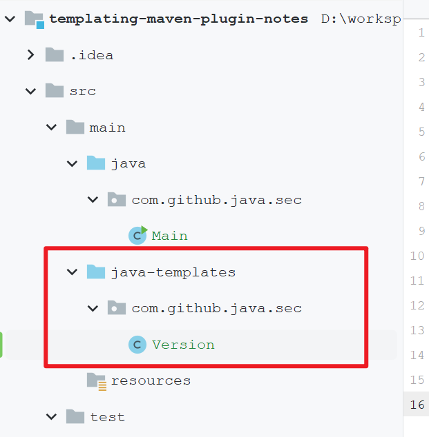
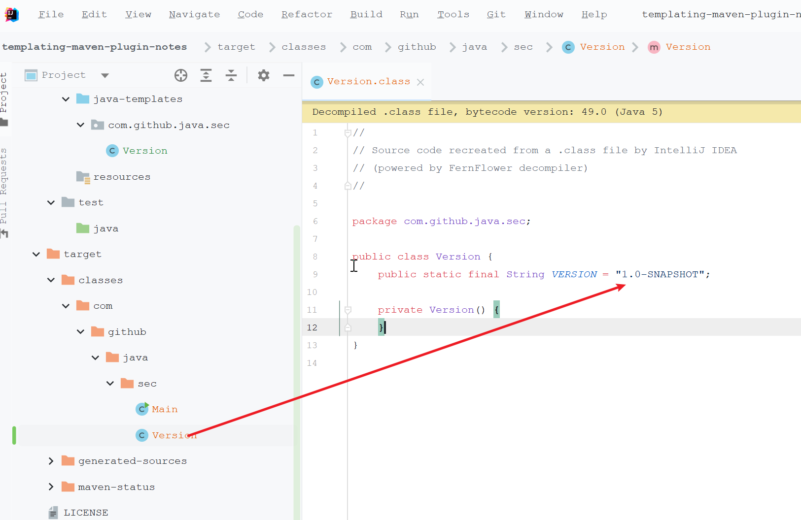
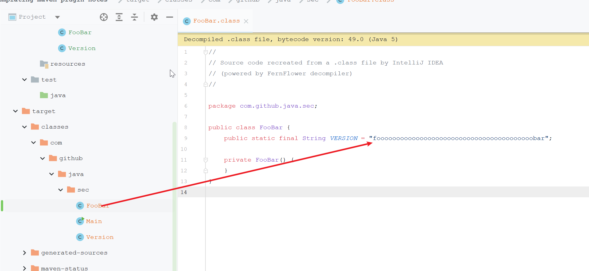
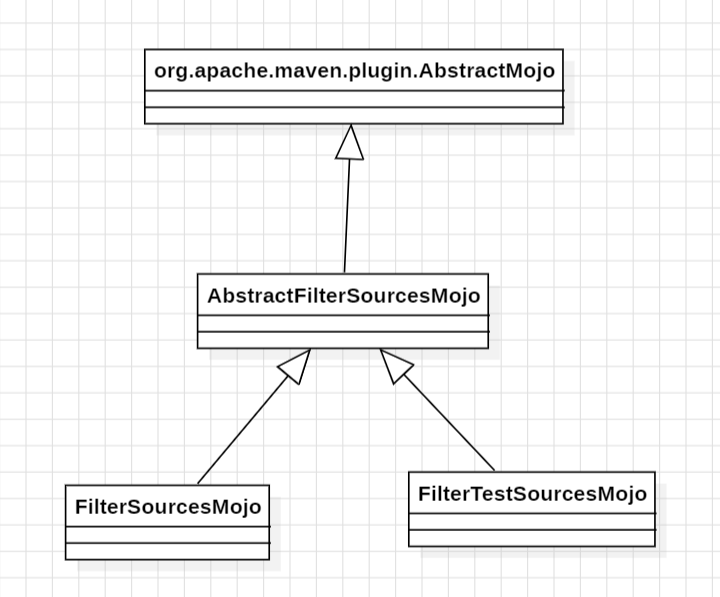

# Release Jar内嵌版本号实践方案（基于templating-maven-plugin）

# 一、业务场景

Java的应用程序通过Maven来管理模块和依赖，应用程序在运行的时候可能需要用到自己的版本号：

- 比如如果是客户端程序，跟服务端通讯的时候肯定要涉及到的一些版本兼容性的问题，那这个时候就必须得知道自己的版本号
- 比如如果是网络程序，在协议或者发送HTTP请求的User-Agent中可能就需要带上自己的版本号

总之会有各种场景的需求要能在运行时获取到版本号，本文重点关注怎么实现。

# 二、尝试通过Maven插件解决

此处尝试通过引入Maven插件的方式来解决这个问题，用到的Maven插件是`org.codehaus.mojo:templating-maven-plugin`，其Maven中央仓库地址：

```
https://mvnrepository.com/artifact/org.codehaus.mojo/templating-maven-plugin
```

这个插件工作的流程：

- 我们创建一些模板文件，通常是Java源代码跟普通的Java代码没啥区别，只是会在模板文件中在字符串的值的地方使用`${project.version}`的方式设置一些变量占位符，比如`public static final String VERSION = "${project.version}";`
- 然后把这个路径告诉插件，插件在Maven打包的阶段就会扫描给定路径下的文件，渲染变量的值做替换

下面来看一个实际的例子，为了保证尽可能不出错，我们通常会创建一个单独的文件夹，只把必要的文件放在下面，比如我们需要做版本替换，则创建一个Version类：

```java
package com.github.java.sec;

/**
 * @author CC11001100
 */
public class Version {

    // templating-maven-plugin 插件的 filter-sources goal 会把这个字段注入进来
    public static final String VERSION = "${project.version}";

    // 禁止被实例化，只能静态引用
    private Version() {
    }

}
```

位置：



pom.xml大概是这样，就是引入插件然后指定模板文件的位置： 

```xml
<?xml version="1.0" encoding="UTF-8"?>
<project xmlns="http://maven.apache.org/POM/4.0.0"
         xmlns:xsi="http://www.w3.org/2001/XMLSchema-instance"
         xsi:schemaLocation="http://maven.apache.org/POM/4.0.0 http://maven.apache.org/xsd/maven-4.0.0.xsd">
    <modelVersion>4.0.0</modelVersion>

    <groupId>com.github.java.sec</groupId>
    <artifactId>templating-maven-plugin-notes</artifactId>
    <version>1.0-SNAPSHOT</version>

    <properties>
        <templating-maven-plugin.version>1.0.0</templating-maven-plugin.version>
    </properties>

    <developers>
        <developer>
            <name>CC11001100</name>
            <email>cc11001100@qq.com</email>
        </developer>
    </developers>

    <build>
        <plugins>
            <plugin>
                <groupId>org.codehaus.mojo</groupId>
                <artifactId>templating-maven-plugin</artifactId>
                <version>${templating-maven-plugin.version}</version>
                <executions>
                    <execution>
                        <id>filtering-java-templates</id>
                        <goals>
                            <goal>filter-sources</goal>
                        </goals>
                        <configuration>
                            <!-- 此处配置的是模板文件的位置 -->
                            <sourceDirectory>src/main/java-templates</sourceDirectory>
                        </configuration>
                    </execution>
                </executions>
            </plugin>
        </plugins>
    </build>

</project>
```

在使用的时候直接引用常量：

```java
package com.github.java.sec;

/**
 * @author CC11001100
 */
public class Main {

    public static void main(String[] args) {
        System.out.println(Version.VERSION);
    }

}
```

Maven compile一下，看一下编译后的文件：



可以看到变量的值被正确替换了，不只是内置的变量，尝试在pom.xml中添加一个自定义的变量：

```xml
    <properties>
        <templating-maven-plugin.version>1.0.0</templating-maven-plugin.version>
        <foo.bar>foooooooooooooooooooooooooooooooooooooooobar</foo.bar>
    </properties>
```

然后在模板文件夹下继续创建类：

```java
package com.github.java.sec;

/**
 * @author CC11001100
 */
public class FooBar {
    
    // templating-maven-plugin 插件的 filter-sources goal 会把这个字段注入进来
    public static final String VERSION = "${foo.bar}";

    // 禁止被实例化，只能静态引用
    private FooBar() {
    }

}
```

继续Maven compile编译，查看编译后的源代码：



# 三、源码阅读

知其然知其所以然，我们来阅读一下这个插件的源代码康康它是怎么实现的，插件的代码仓库：

```
https://github.com/mojohaus/templating-maven-plugin
```

实现代码很简单，只有三个类，`UML`大概如图： 



其中主要的逻辑都在`AbstractFilterSourcesMojo`中的`filterSourceToTemporaryDir`方法：

```java
    private void filterSourceToTemporaryDir(final File sourceDirectory, final File temporaryDirectory)
            throws MojoExecutionException {
        List<Resource> resources = new ArrayList<>();
        Resource resource = new Resource();
        resource.setFiltering(true);
        logDebug("Source absolute path: %s", sourceDirectory.getAbsolutePath());
        resource.setDirectory(sourceDirectory.getAbsolutePath());
        resources.add(resource);
        
        MavenResourcesExecution mavenResourcesExecution = new MavenResourcesExecution(resources, temporaryDirectory, project, encoding, Collections.emptyList(), Collections.emptyList(), session);
        mavenResourcesExecution.setInjectProjectBuildFilters(true);
        mavenResourcesExecution.setEscapeString(escapeString);
        mavenResourcesExecution.setOverwrite(overwrite);
        setDelimitersForExecution(mavenResourcesExecution);
        try {
            mavenResourcesFiltering.filterResources(mavenResourcesExecution);
        } catch (MavenFilteringException e) {
            throw new MojoExecutionException(e.getMessage(), e);
        }
    }
```

核心是把`MavenResourcesExecution`的`setInjectProjectBuildFilters`设置为`true`，完整的代码：

```java
package org.codehaus.mojo.templating;

/*
 * Licensed to the Apache Software Foundation (ASF) under one
 * or more contributor license agreements.  See the NOTICE file
 * distributed with this work for additional information
 * regarding copyright ownership.  The ASF licenses this file
 * to you under the Apache License, Version 2.0 (the
 * "License"); you may not use this file except in compliance
 * with the License.  You may obtain a copy of the License at
 *
 *  http://www.apache.org/licenses/LICENSE-2.0
 *
 * Unless required by applicable law or agreed to in writing,
 * software distributed under the License is distributed on an
 * "AS IS" BASIS, WITHOUT WARRANTIES OR CONDITIONS OF ANY
 * KIND, either express or implied.  See the License for the
 * specific language governing permissions and limitations
 * under the License.
 */

import org.apache.maven.execution.MavenSession;
import org.apache.maven.model.Resource;
import org.apache.maven.plugin.AbstractMojo;
import org.apache.maven.plugin.MojoExecutionException;
import org.apache.maven.plugins.annotations.Component;
import org.apache.maven.plugins.annotations.Parameter;
import org.apache.maven.project.MavenProject;
import org.apache.maven.shared.filtering.MavenFilteringException;
import org.apache.maven.shared.filtering.MavenResourcesExecution;
import org.apache.maven.shared.filtering.MavenResourcesFiltering;
import org.codehaus.plexus.util.FileUtils;

import java.io.*;
import java.util.ArrayList;
import java.util.Collections;
import java.util.LinkedHashSet;
import java.util.List;
import java.util.zip.CRC32;

/**
 * The base class for {@link FilterSourcesMojo} and {@link FilterTestSourcesMojo}
 */
public abstract class AbstractFilterSourcesMojo extends AbstractMojo {

    private static final int CHECKSUM_BUFFER = 4096;

    private int copied = 0;

    /**
     * @return The location of the source directory.
     */
    protected abstract File getSourceDirectory();

    /**
     * @return The location of the output directory.
     */
    protected abstract File getOutputDirectory();

    /**
     * The character encoding scheme to be applied when filtering resources.
     */
    @Parameter(defaultValue = "${project.build.sourceEncoding}")
    private String encoding;

    /**
     * Expression preceded with the String won't be interpolated \${foo} will be replaced with ${foo}
     */
    @Parameter(property = "maven.resources.escapeString")
    protected String escapeString;

    /**
     * Set of delimiters for expressions to filter within the resources. These delimiters are specified in the form
     * 'beginToken*endToken'. If no '*' is given, the delimiter is assumed to be the same for start and end. So, the
     * default filtering delimiters might be specified as:
     *
     * <pre>
     * &lt;delimiters&gt;
     *   &lt;delimiter&gt;${*}&lt;/delimiter&gt;
     *   &lt;delimiter&gt;@&lt;/delimiter&gt;
     * &lt;/delimiters&gt;
     * </pre>
     * <p>
     * Since the '@' delimiter is the same on both ends, we don't need to specify '@*@' (though we can).
     */
    @Parameter
    protected List<String> delimiters;

    /**
     * Controls whether the default delimiters are included in addition to those configured {@link #delimiters}. Does
     * not have any effect if {@link #delimiters} is empty when the defaults will be included anyway.
     */
    @Parameter(defaultValue = "true")
    protected boolean useDefaultDelimiters;

    @Parameter(defaultValue = "${session}", required = true, readonly = true)
    private MavenSession session;

    @Parameter(defaultValue = "${project}", required = true, readonly = true)
    private MavenProject project;

    /**
     * Controls whether to overwrite files that are not changed, by default files will not be overwritten
     */
    @Parameter(defaultValue = "false")
    protected boolean overwrite;

    /**
     * Skips POM projects if set to true, which is the default option.
     */
    @Parameter(defaultValue = "true")
    protected boolean skipPoms;

    /**
     * The resources filtering which is used.
     */
    @Component(hint = "default")
    protected MavenResourcesFiltering mavenResourcesFiltering;

    /**
     * {@inheritDoc}
     */
    public void execute() throws MojoExecutionException {

        File sourceDirectory = getSourceDirectory();
        if (!preconditionsFulfilled(sourceDirectory)) {
            return;
        }

        // 1. Copy with filtering the given source to temporary dir
        copied = 0;
        File temporaryDirectory = getTemporaryDirectory(sourceDirectory);
        logInfo("Copying files with filtering to temporary directory.");
        logDebug("Temporary directory for filtering is: %s", temporaryDirectory);
        filterSourceToTemporaryDir(sourceDirectory, temporaryDirectory);

        // 2. Copy if needed
        copyDirectoryStructure(temporaryDirectory, getOutputDirectory());
        cleanupTemporaryDirectory(temporaryDirectory);
        if (isSomethingBeenUpdated()) {
            logInfo("Copied %d files to output directory: %s", copied, getOutputDirectory());
        } else {
            logInfo("No files need to be copied to output directory. Up to date: %s", getOutputDirectory());
        }

        // 3 Add that dir to sources
        addSourceFolderToProject(this.project);
        logInfo("Source directory: %s added.", getOutputDirectory());
    }

    /**
     * @return number of copied files.
     */
    protected int countCopiedFiles() {
        return copied;
    }

    private void logInfo(String format, Object... args) {
        if (getLog().isInfoEnabled()) {
            getLog().info(String.format(format, args));
        }
    }

    private void logDebug(String format, Object... args) {
        if (getLog().isDebugEnabled()) {
            getLog().debug(String.format(format, args));
        }
    }

    private boolean isSomethingBeenUpdated() {
        return copied > 0;
    }

    private void cleanupTemporaryDirectory(File temporaryDirectory)
            throws MojoExecutionException {
        try {
            FileUtils.forceDelete(temporaryDirectory);
        } catch (IOException ex) {
            throw new MojoExecutionException(ex.getMessage(), ex);
        }
    }

    /**
     * 这个方法是做变量替换的关键
     *
     * @param sourceDirectory
     * @param temporaryDirectory
     * @throws MojoExecutionException
     */
    private void filterSourceToTemporaryDir(final File sourceDirectory, final File temporaryDirectory)
            throws MojoExecutionException {
        List<Resource> resources = new ArrayList<>();
        Resource resource = new Resource();
        resource.setFiltering(true);
        logDebug("Source absolute path: %s", sourceDirectory.getAbsolutePath());
        resource.setDirectory(sourceDirectory.getAbsolutePath());
        resources.add(resource);

        MavenResourcesExecution mavenResourcesExecution = new MavenResourcesExecution(resources, temporaryDirectory, project, encoding, Collections.emptyList(), Collections.emptyList(), session);
        mavenResourcesExecution.setInjectProjectBuildFilters(true);
        mavenResourcesExecution.setEscapeString(escapeString);
        mavenResourcesExecution.setOverwrite(overwrite);
        setDelimitersForExecution(mavenResourcesExecution);
        try {
            mavenResourcesFiltering.filterResources(mavenResourcesExecution);
        } catch (MavenFilteringException e) {
            throw new MojoExecutionException(e.getMessage(), e);
        }
    }

    private void setDelimitersForExecution(MavenResourcesExecution mavenResourcesExecution) {
        // if these are NOT set, just use the defaults, which are '${*}' and '@'.
        if (delimiters != null && !delimiters.isEmpty()) {
            LinkedHashSet<String> delims = new LinkedHashSet<>();
            if (useDefaultDelimiters) {
                delims.addAll(mavenResourcesExecution.getDelimiters());
            }

            for (String delim : delimiters) {
                if (delim == null) {
                    // FIXME: ${filter:*} could also trigger this condition. Need a better long-term solution.
                    delims.add("${*}");
                } else {
                    delims.add(delim);
                }
            }

            mavenResourcesExecution.setDelimiters(delims);
        }
    }

    private void preconditionsCopyDirectoryStructure(final File sourceDirectory, final File destinationDirectory,
                                                     final File rootDestinationDirectory)
            throws IOException {
        if (sourceDirectory == null) {
            throw new IOException("source directory can't be null.");
        }

        if (destinationDirectory == null) {
            throw new IOException("destination directory can't be null.");
        }

        if (sourceDirectory.equals(destinationDirectory)) {
            throw new IOException("source and destination are the same directory.");
        }

        if (!sourceDirectory.exists()) {
            throw new IOException("Source directory doesn't exists (" + sourceDirectory.getAbsolutePath() + ").");
        }
    }

    private void copyDirectoryStructure(final File sourceDirectory, final File destinationDirectory)
            throws MojoExecutionException {
        try {
            File target = destinationDirectory;
            if (!target.isAbsolute()) {
                target = resolve(project.getBasedir(), destinationDirectory.getPath());
            }
            copyDirectoryStructureWithIO(sourceDirectory, target, target);
        } catch (IOException ex) {
            throw new MojoExecutionException(ex.getMessage(), ex);
        }
    }

    private void copyDirectoryStructureWithIO(final File sourceDirectory, final File destinationDirectory,
                                              final File rootDestinationDirectory)
            throws IOException {
        preconditionsCopyDirectoryStructure(sourceDirectory, destinationDirectory, rootDestinationDirectory);
        File[] files = sourceDirectory.listFiles();
        if (files == null) {
            return;
        }
        String sourcePath = sourceDirectory.getAbsolutePath();

        for (File file : files) {
            if (file.equals(rootDestinationDirectory)) {
                // We don't copy the destination directory in itself
                continue;
            }

            String dest = file.getAbsolutePath();

            dest = dest.substring(sourcePath.length() + 1);

            File destination = new File(destinationDirectory, dest);

            if (file.isFile()) {
                destination = destination.getParentFile();

                if (isFileDifferent(file, destination)) {
                    copied++;
                    FileUtils.copyFileToDirectory(file, destination);
                }
            } else if (file.isDirectory()) {
                if (!destination.exists() && !destination.mkdirs()) {
                    throw new IOException("Could not create destination directory '" + destination.getAbsolutePath()
                            + "'.");
                }

                copyDirectoryStructureWithIO(file, destination, rootDestinationDirectory);
            } else {
                throw new IOException("Unknown file type: " + file.getAbsolutePath());
            }
        }
    }

    private File resolve(final File file, final String... subfile) {
        StringBuilder path = new StringBuilder();
        path.append(file.getPath());
        for (String fi : subfile) {
            path.append(File.separator);
            path.append(fi);
        }
        return new File(path.toString());
    }

    private boolean isFileDifferent(final File file, final File directory)
            throws IOException {
        File targetFile = resolve(directory, file.getName()).getAbsoluteFile();
        return !targetFile.canRead() || getCrc32OfFile(file) != getCrc32OfFile(targetFile);
    }

    private long getCrc32OfFile(final File target)
            throws IOException {
        FileInputStream fis = null;
        try {
            fis = new FileInputStream(target);
            CRC32 crcMaker = new CRC32();
            byte[] buffer = new byte[CHECKSUM_BUFFER];
            int bytesRead;
            while ((bytesRead = fis.read(buffer)) != -1) {
                crcMaker.update(buffer, 0, bytesRead);
            }
            return crcMaker.getValue();
        } catch (FileNotFoundException ex) {
            close(fis);
            throw new IOException(ex.getLocalizedMessage(), ex);
        } finally {
            close(fis);
        }
    }

    private void close(Closeable is)
            throws IOException {
        if (is != null) {
            is.close();
        }
    }

    /**
     * 获取模板要存储到的临时目录
     *
     * @param sourceDirectory
     * @return
     */
    private File getTemporaryDirectory(File sourceDirectory) {
        File basedir = project.getBasedir();
        File target = new File(project.getBuild().getDirectory());
        StringBuilder label = new StringBuilder("templates-tmp");
        CRC32 crcMaker = new CRC32();
        crcMaker.update(sourceDirectory.getPath().getBytes());
        label.append(crcMaker.getValue());
        String subfile = label.toString();
        return target.isAbsolute() ? resolve(target, subfile) : resolve(basedir, target.getPath(), subfile);
    }

    /**
     * 在正式开始处理之前对要处理的目录做一些检查，康康是否符合处理的条件
     *
     * @param sourceDirectory
     * @return
     */
    private boolean preconditionsFulfilled(File sourceDirectory) {

        // 比如跳过pom文件？
        if (skipPoms && "pom".equals(project.getPackaging())) {
            logInfo("Skipping POM project type. Change `skipPoms` to false to run anyway.");
            return false;
        }
        logDebug("source=%s target=%s", sourceDirectory, getOutputDirectory());

        // 要处理的目录必须存在
        if (!(sourceDirectory != null && sourceDirectory.exists())) {
            logInfo("Requested directory '%s' not added since it does not exist.", sourceDirectory);
            return false;
        }

        return true;
    }

    /**
     * @param mavenProject {@link MavenProject}
     */
    protected abstract void addSourceFolderToProject(MavenProject mavenProject);
}
```

然后是看一下`FilterSourcesMojo`这个类，这个只需要关注一下默认的模板路径是`${basedir}/src/main/java-templates`，其它就没啥好看的了：

```java
package org.codehaus.mojo.templating;

/*
 * Licensed to the Apache Software Foundation (ASF) under one
 * or more contributor license agreements.  See the NOTICE file
 * distributed with this work for additional information
 * regarding copyright ownership.  The ASF licenses this file
 * to you under the Apache License, Version 2.0 (the
 * "License"); you may not use this file except in compliance
 * with the License.  You may obtain a copy of the License at
 *
 *  http://www.apache.org/licenses/LICENSE-2.0
 *
 * Unless required by applicable law or agreed to in writing,
 * software distributed under the License is distributed on an
 * "AS IS" BASIS, WITHOUT WARRANTIES OR CONDITIONS OF ANY
 * KIND, either express or implied.  See the License for the
 * specific language governing permissions and limitations
 * under the License.
 */

import org.apache.maven.plugins.annotations.LifecyclePhase;
import org.apache.maven.plugins.annotations.Mojo;
import org.apache.maven.plugins.annotations.Parameter;
import org.apache.maven.project.MavenProject;

import java.io.File;

/**
 * This mojo helps adding a filtered source folder in one go. This is typically useful if you want to use properties
 * coming from the POM inside parts of your source code that requires real constants, like annotations for example.
 */
@Mojo(name = "filter-sources", defaultPhase = LifecyclePhase.GENERATE_SOURCES, threadSafe = true)
public class FilterSourcesMojo extends AbstractFilterSourcesMojo {
    
    /**
     * Source directory that will be first filtered and then added as a classical source folder.
     */
    @Parameter(defaultValue = "${basedir}/src/main/java-templates")
    File sourceDirectory;

    /**
     * Output folder where filtered sources will land.
     */
    @Parameter(defaultValue = "${project.build.directory}/generated-sources/java-templates")
    private File outputDirectory;

    @Override
    protected File getSourceDirectory() {
        return sourceDirectory;
    }

    @Override
    protected File getOutputDirectory() {
        return outputDirectory;
    }

    @Override
    protected void addSourceFolderToProject(MavenProject mavenProject) {
        mavenProject.addCompileSourceRoot(getOutputDirectory().getAbsolutePath());
    }
}
```

# 四、存在的问题

直接在Idea中run是不会运行Maven的build插件执行替换的，只有在Maven方式编译的时候才能生效，那么如何让Idea直接run的时候运行Maven的build插件呢？要不然它不替换啊就蛋疼了。

不过对于Agent类产品似乎无所谓了？反正也要发包之后attach不影响...

# 五、参考资料

- https://www.mojohaus.org/templating-maven-plugin/
- https://github.com/mojohaus/templating-maven-plugin